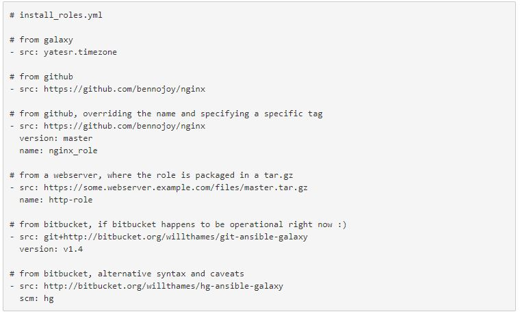

# Ansible role management

## Introduction

The main purpose of this documentation is to introduce best practices to
be followed for Ansible role management. This document should walk you
through the basics of writing reusable roles with dependencies backed by
public and private git repositories.

## Why do we need role management?

Ansible role are meant to be reusable. However it becomes difficult if
we do not manage our roles centrally and have an individual copy for
each of the project. You can compare this with having individual copy of
the application code with each of the developer working on it. This does
not only wastes memory by keeping multiple copies of the same role but
also causes major problems while maintaining updates across all the
copies. This is why we need a system wherein we can get the specific
version of a role from a central repository so that we can manage it in
easier way.

## Ansible Galaxy and Role Management

Ansible Galaxy can refer to one of  two things:

-   a website for sharing and downloading Ansible roles

-   a command line tool that facilitates working with roles

This is analogous to central maven repository in maven dependency
management system from where we can get all the necessary dependencies
for our project. However Ansible Galaxy is one step ahead. It not only
gives you provision to download existing roles from its central
repository but also allows you to download roles from public or private
version control system. This way we need not have to keep our roles in
Ansible Galaxy, thus giving security feature to the roles which are
sensitive for the organization.

## How to manage roles using Ansible Galaxy

We can use following steps to manage ansible roles using Ansible Galaxy:

Beginning with Ansible 1.8 it is possible to install multiple roles by
including the roles in a *requirements.yml* file. The format of the file
is YAML, and the file extension must be either *.yml* or *.yaml*.

Use the following command to install roles included
in *requirements.yml*:

    $ ansible-galaxy install -r requirements.yml

Again, the extension is important. If the *.yml* extension is left off,
the ansible-galaxy CLI assumes the file is in an older, now deprecated,
“basic” format. Roles could be downloaded from variety of sources like
ansible-galaxy, public or private git repository, from web server,
BitBucket etc. Following sample requirements.yml file gives idea about
how can this be done.

Note: In order to use roles from git, we have to ensure that git is
installed on our ansible server from where we are executing the
playbook.

## Downloading Ansible roles through requirements.yml

Following steps are to be followed in order to download ansible roles.

Step 1: Create a .yml file with any name e.g. my\_roles.yml

Step 2: Include all the roles required to be downloaded from all
different sources as shown in the sample file above.

Step 3: Execute the command $ ansible-galaxy install -r my\_roles.yml
Note that you would need Ansible version 1.8 or higher in order to use
ansible-galaxy command line utility. This would download the required
roles.

Step 4: Now you can run your playbook so that all the required roles are
in place.

## How to automate the process?

Above process is a manual process in which you have to execute the
ansible-galaxy command manually before running playbook. How about if we
could automate that part? Yes! It is absolutely possible for us to do so
through vagrant provisioner. We can do it the following way:

In your vagrant provisioner use ansible.galaxy\_role\_file =
'ansible/requirements.yml' in your ansible provisioner. So whenever
provisioner runs it first downloads all the roles from requirements.yml
file and then executes the ansible playbook. This way we can incorporate
ansible-galaxy command in our VagrantFile and automate the process.

For more information about Ansible role management using ansible-galaxy
please refer to

<https://galaxy.ansible.com/intro>

For more information about incorporating ansible-galaxy command in
Vagrant provisioner please refer to
<https://www.vagrantup.com/docs/provisioning/ansible_common.html#galaxy_command>
